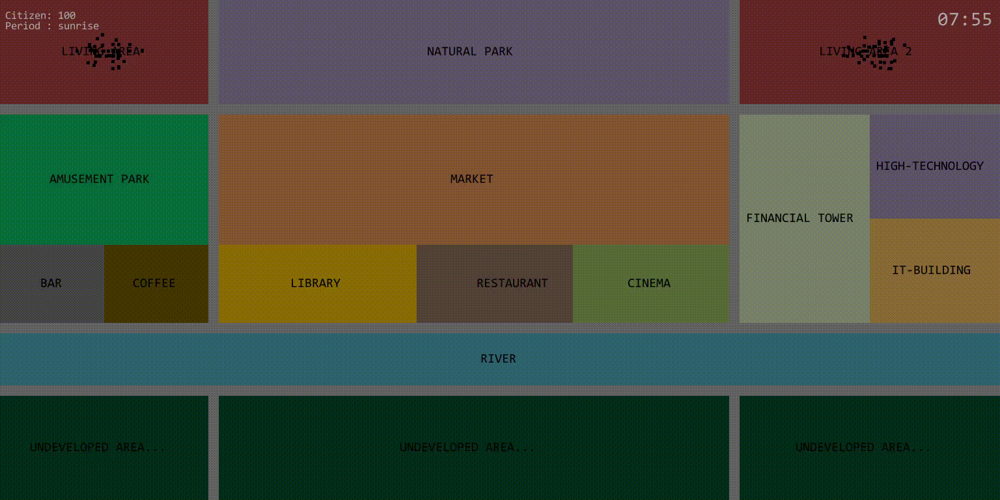
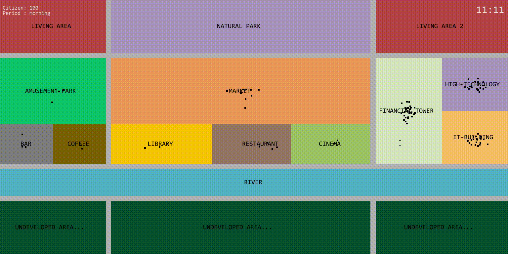

## SimCity

### 1. Introduction

一个小型城市的模拟，每一个小黑点代表一个市民，每个市民拥有自己的工作，白天会在城市指定区域工作。右上角为一天中的当前时间（小时：分钟），当到达某些指定时间时会触发一些特殊事件，如午餐、下班、晚饭后散步逛商场等。

* 早晨8：00，市民们开始上班

<div align=center></div>

* 中午市民们去到餐厅吃午饭

<div align=center></div>

### 2. Usage

* clone 项目

```bash
git clone https://github.com/HarderThenHarder/SimCity.git
```
* 运行项目

```bash
python Main.py
```